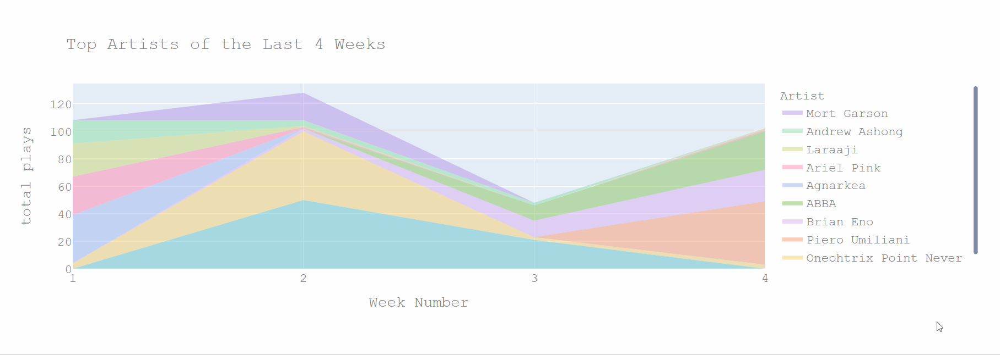
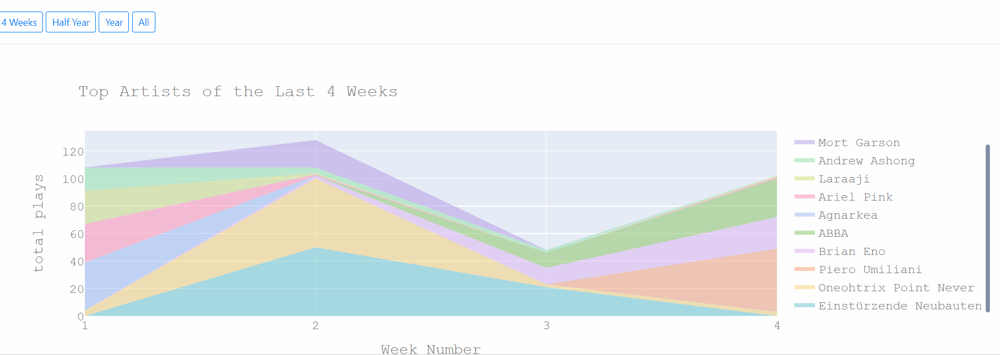

## Final version of the programming project of the minor programming
Streams Flow is a webapplication made using Python (Django).
The perpose is to visualise data from [Last.fm](Last.fm), which tracks the music you listen to. 
Data was gathered from the [Last.fm](Last.fm) API.

Although this is the final version, there was still work to be done. For instance the commenting and efficiency of the code are not as it should be.

### Two examples of what the web app would show you

